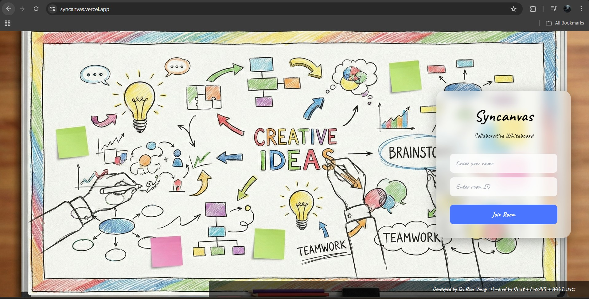
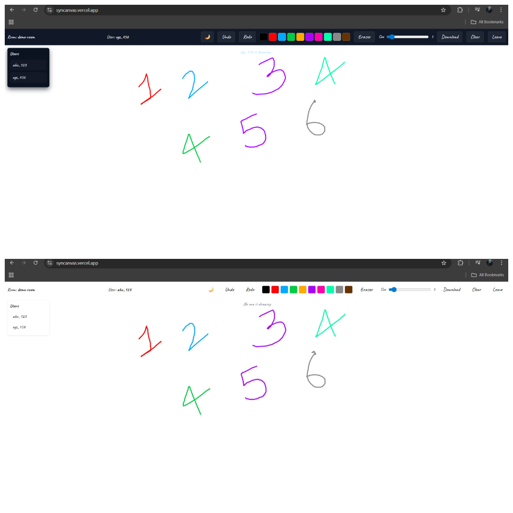

# ✨ SyncCanvas — Real-Time Collaborative Whiteboard  
### Built by **Sri Ram Vinay**

SyncCanvas is a real-time collaborative whiteboard that allows multiple users to draw, share ideas, and collaborate inside a common room.  
It supports live drawing, cursor tracking, clearing the board, and smooth real-time interactions using WebSockets.

The frontend is built using **React + Vite**, and the backend uses **FastAPI + WebSockets**.  
The system is fully deployed using **Vercel** (frontend) and **Render** (backend).

---

## 🚀 Live Demo

### 🔹 Frontend (Vercel)  
https://syncanvas.vercel.app  

### 🔹 Backend (Render)  
https://syncanvas.onrender.com  

---

## 📝 Important Note  
When the first user enters a room, **there may be a small delay (5–20 sec)** before the very first stroke syncs.  
After the connection stabilizes, syncing becomes instant.  
This is because the WebSocket server on free hosting may take a moment to warm up.

---

## 🎯 Key Features

### 🖍️ Real-Time Drawing  
- Smooth stroke rendering  
- Broadcasts drawing updates to all users in the room  

### 👥 Multi-User Rooms  
- Join by creating/entering a Room ID  
- View active users  
- Unique cursor per user  

### 🖱️ Live Cursor Tracking  
- See other users’ cursor movements in real time  

### 🔄 WebSocket Sync Engine  
- Auto reconnect  
- Message queue when socket is closed  
- Handles events: join, leave, strokes, cursor, clear  

### 🎨 UI & Experience  
- Clean, responsive interface  
- Dark mode toggle  
- Pen color picker  
- Undo / redo  
- Clear board for everyone  

---

## 🧰 Tech Stack

### **Frontend**
- React (Vite)
- TailwindCSS
- Custom WebSocket hook
- Vercel Deployment

### **Backend**
- FastAPI
- WebSockets
- Uvicorn
- Python-dotenv
- Render Deployment

---

## 📸 Screenshots

Your screenshots folder should be placed at:

```
syncanvas/screenshots/
```

Example structure:

```
/screenshots
  ├── homepage.png
  └── drawing.png
```

### 🏠 Homepage  


### 🎨 Drawing Board  


---

## 📦 Folder Structure

```
syncanvas/
├── frontend/
│   ├── src/
│   │   ├── canvas/
│   │   ├── ws/
│   │   ├── ui/
│   │   └── styles/
│   ├── index.html
│   ├── vite.config.js
│   ├── package.json
│
├── syncanvas-backend/
│   ├── app/
│   │   ├── main.py
│   │   ├── ws/
│   │   │   ├── manager.py
│   │   │   ├── events.py
│   │   │   ├── event_router.py
│   │   │   └── state_buffer.py
│   ├── requirements.txt
│
└── README.md
```

---

## 🛠️ Local Setup

### 1️⃣ Clone the Repo
```bash
git clone https://github.com/KsrVinay/syncanvas
cd syncanvas
```

---

## 🔧 Backend Setup (FastAPI)

```bash
cd syncanvas-backend
pip install -r requirements.txt
uvicorn app.main:app --reload
```

Backend runs at:  
http://localhost:8000  

---

## 🎨 Frontend Setup (React + Vite)

```bash
cd frontend
npm install
npm run dev
```

Frontend runs at:  
http://localhost:3000  

---

## 🌍 Environment Variable (Frontend)

Vercel uses:

```
VITE_BACKEND_URL = https://syncanvas.onrender.com
```

WebSocket generation:

```js
const base = import.meta.env.VITE_BACKEND_URL.replace("http", "ws");
```

---

## 🧪 How to Test

1. Open the frontend link  
2. Enter Room ID + Username  
3. Join the whiteboard  
4. Open the same room in another device or browser  
5. Draw → strokes sync in real time  
6. Cursor movement is live  
7. Clear button resets board for everyone  
8. Dark mode toggle & pen color selection  
9. Undo / redo drawing  

---

## 📄 Deployment Steps (Summary)

### **Backend — Render**
- Set root directory → `syncanvas-backend`
- Build command → `pip install -r requirements.txt`
- Start command → `uvicorn app.main:app --host 0.0.0.0 --port 8000`
- Add environment variables (if needed)
- Deploy

### **Frontend — Vercel**
- Root directory → `frontend`
- Install command → `npm install`
- Build command → `npm run build`
- Output directory → `dist`
- Add env var:  
  ```
  VITE_BACKEND_URL = https://syncanvas.onrender.com
  ```
- Deploy

---

## 🏆 Project overview
- Shows real-time backend experience 
- Demonstrates WebSocket handling and event routing 
- Clean, modular frontend + backend structure 
- Fully deployed full-stack project 
- Professional production setup (Vercel + Render)

---

## 📄 MIT License

```
MIT License

Permission is hereby granted, free of charge, to any person obtaining a copy
of this software and associated documentation files (the "Software"), to deal
in the Software without restriction, including without limitation the rights
to use, copy, modify, merge, publish, distribute, sublicense, and/or sell
copies of the Software.

THE SOFTWARE IS PROVIDED "AS IS", WITHOUT WARRANTY OF ANY KIND.
```

---

### 🙌 Author  
**Sri Ram Vinay**  
GitHub: https://github.com/KsrVinay  
